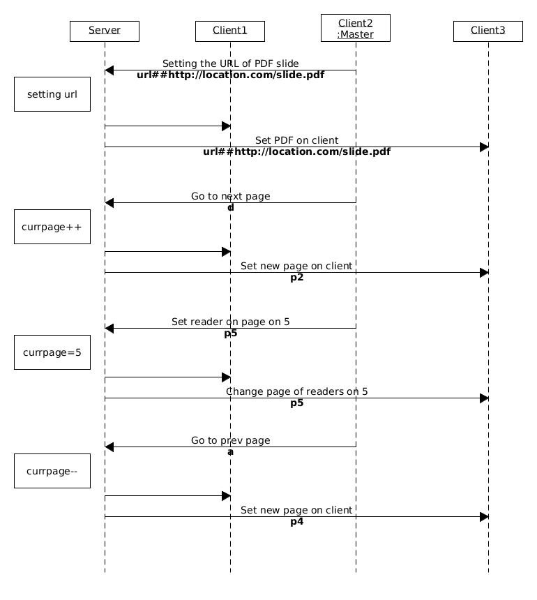

# remote-control-slide

Remote Control Slide is a tool to control the PDF slide presentation with other browser clients.

This is based on the WebSocket standard implemented via a [Tornado](https://www.tornadoweb.org) library and the web standards-based platform for parsing and rendering PDFs [pdf.js](https://mozilla.github.io/pdf.js/) to view the pdf slides.

# Quick Start

## Prerequisites

To use the program you must have install [Tornado](https://www.tornadoweb.org) library. You can simply install with:

```bash
pip install tornado
```

To run the application do:

```bash
cd server
python server.py
```

See below for specific info about type of network.

Now the web pages for clients are availeble on *http://localhost:8000/index.html* and for the master on *http://localhost:8000/master.html*


## In LAN Use-case

If you are in a LAN network, your clients can use your PC as server controller.

It is not said that your PC should be a master: : it can also be a client.


## In Internet Use-case

The same, but you have obviously 2 options:

- Run this on a VPS server with python
- Run on your PC; you must use a DDNS service linked to the public IP of your router and binding a port of the router to the port used from the application of your private IP


# More info

The protocol is message-based: the first client that is self-proclamed master will take the control of the flux of the slide on all client connected.

Simply the are 3 types of use-case thinked:

- Set the url of the PDF to view
- Go to next/prev page of the slide
- Set a specific page

On each client there is a socket that changes the status of [pdf.js](https://mozilla.github.io/pdf.js/) to the arrival of the messages established by the protocol

## The Protocol

Suppose you have 4 terminals, one of which is the server that runs the application.

In the first step the all terminal connect to the server


In this phase, at every connection, the server warns which PDF to read and the current page.


The election of the master takes place in FCFS mode: the first that sends the `master` message to the server can manage the communication until the termination of the application or until that client ends


Now all the commands sent from the master to the server are replicated on all the clients:



- To set an url of PDF a string `url##http://url/of/doc.pdf` is sent from the master to the server, it changes the internal state and informs the other clients with the same string

- If the master want to go to the next or prev page it will can send a message `d` or `a` message to the server. in this case the server tell to all clients the new current page with a message `px`, where *x* is the number of the new page

- Or if the master wants to set a specific page of the slide it will send a message 'px' to the server: at the same way the server informs all clients.